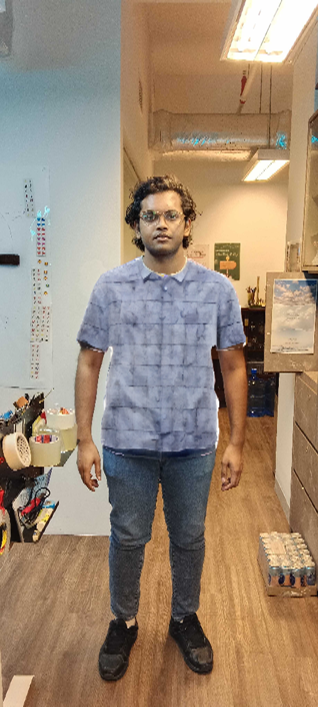

# DeepPaint
- Unofficial Implementation of DeepPaint
- Paper Link:

## Results

<table style="padding:10px">
  <tr>
    <td>Clothes\Original</td>
    <td></td>
    <td></td>
    <td></td>
    <td></td>
  </tr>
  <tr>
    <td> </td>
    <td> </td>
    <td></td>
    <td></td>
    <td></td>
   <!--<td></td>-->
  </tr>
</table>
